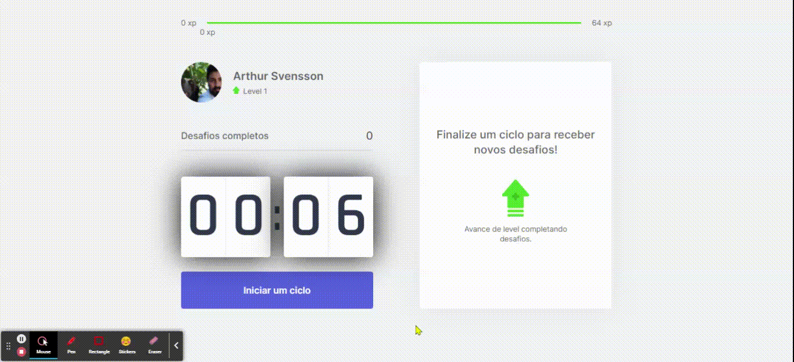

# Te Mexe!

		Desenvolvido na Next Level Week #4 da Rocketseat.

## Objetivo:
		Promover hábitos saudáveis para pessoas que ficam muitas horas no computador.

## Como funciona?
		Ao finalizar o ciclo de 25 minutos (técnica de Pomodoro) você recebe uma notificação
		no navegador com som, informando que há um novo desafio.
		Você deve iniciar o desafio proposto e ao final, informar se fez ou não.
		
		A cada desafio concluído seu nível (xp) aumenta e um novo ciclo de 25 minutos é iniciado.
		Se não concluiu o desafio, sua xp não é alterada.

## DEMO

Disponível no [Vercel](http://temexe-agsvensson.vercel.app/).

